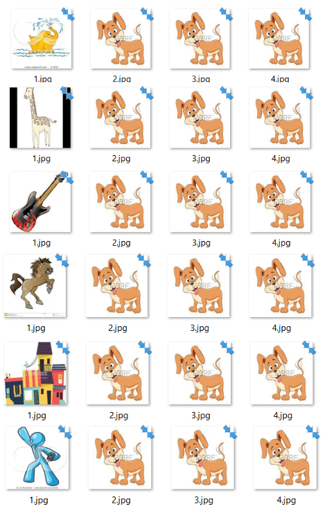
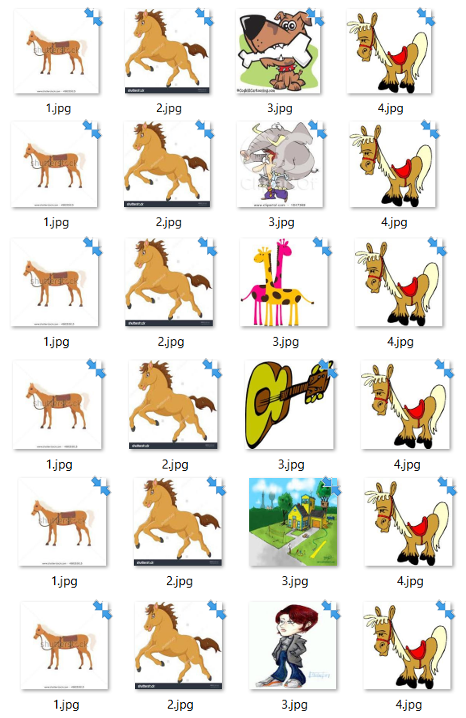
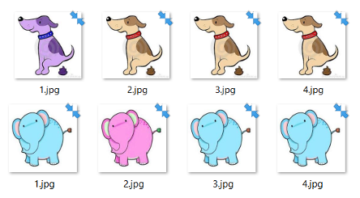
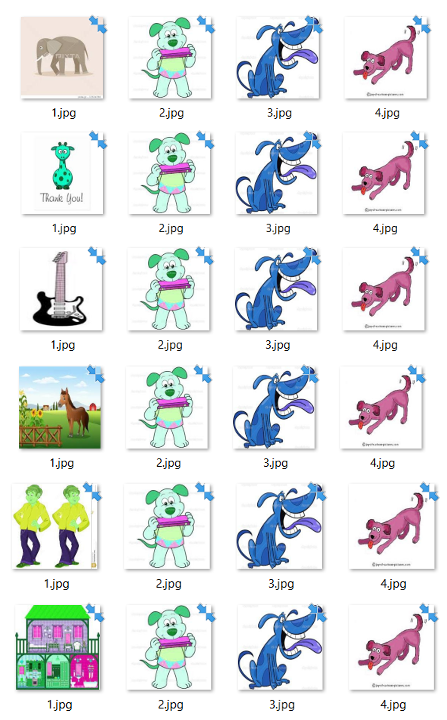
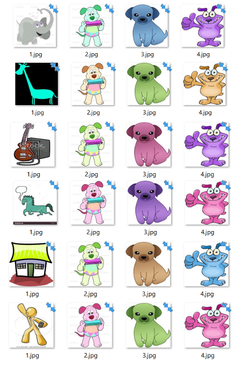

# Datasets
* **dataset1** 
    Contiene la stessa immagine ripetuta tre volte + un'immagine da una classe diversa. 
    La stessa immagine ripetuta compare in 6 set differenti, ognuno con un elemento *odd* diverso;
              
    
* **dataset2** 
    Contiene tre immagini diverse appartenenti alla stessa classe + un'immagine da una classe diversa.
    Ogni combinazione di tre immagini della stessa classe viene ripetuta 6 volte con sei *odd* di classi diverse;
              

* **coloured_dataset_1** 
Contiene la stessa immagine ripetuta tre volte + la stessa immagine con canali RBG invertiti;    

* **coloured_dataset_2** 
    Contiene tre immagini diverse appartenenti alla stessa classe + un'immagine da una classe diversa.
    I canali delle quattro immagini sono invertiti randomicamente. Vengono scelte tre immagini dalla stessa classe e viene 
     applicata la trasformazione, al risultato si aggiunge una quarta immagine proveniente da un'altra classe.
     Il risultato è un dataset in cui ogni combinazione di tre immagini della stessa classe viene ripetuta 6 volte
     con sei *odd* di classi diverse;
            
     
* **coloured_dataset_2.2** 
    E' come *coloured_dataset_2* ma la trasformazione del colore viene applicata ogni volta che viene creata una
    combinazione di quattro immagini. La stessa combinazione di tre immagini viene ripetuta 6 volte con colori alterati
    rendomicamente.
